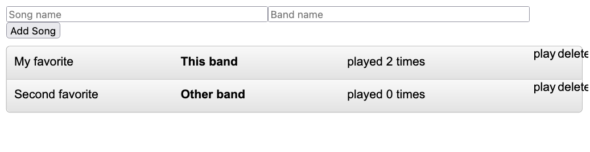
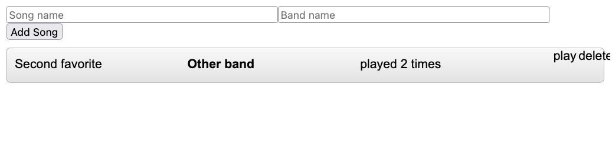

## Bug fix Exercise 1 solution

The code in Exercise 0 and Exercise 1 contain a bug.

### The bug
If you play the first song and then remove it, the count of played will suddenly be seen on the second song.





This is caused by vue trying to be smart, and saving work when updating the HTML.
This can be fixed by introducing a `key` attribute together with `v-for`.
Check the [documentation](https://vuejs.org/guide/essentials/list.html#maintaining-state-with-key).

### First fix

[exercise1_key](exercise1_key.html) uses `name` and `band` as key:

```html
<playlist-item v-for="(song, index) in playlist"
    v-bind:key="song.name + song.band"
    v-bind:song="song">
</playlist-item>
```

This fixes the bug in most cases.
But if you add multiple songs with the same name and band, the bug is still present.
*Try this out for yourself*

### Second fix

[exercise1_key_id](exercise1_key_id.html) adds a unique field in `Song`, `song.id` which is used as key.

```js
let maxId = 0;

class Song{
    constructor(name, band){
        this.name = name;
        this.band = band;
        this.id=maxId++;
   }
}
```

```html
<playlist-item v-for="(song, index) in playlist"
    v-bind:key="song.id"
    v-bind:song="song">
</playlist-item>
```

This solves the error. *Try this out for yourself*

### Workaround

[exercise1_played](exercise1_played.html) 

Adds the number of times a song was played to the global store, instead of making it state in the `songlistItemC` component.
This avoids the bug without using the `key` attribute.

```js
class Song{
    constructor(name, band){
        this.name = name;
        this.band = band;
        this.played = 0;
   }
}
```